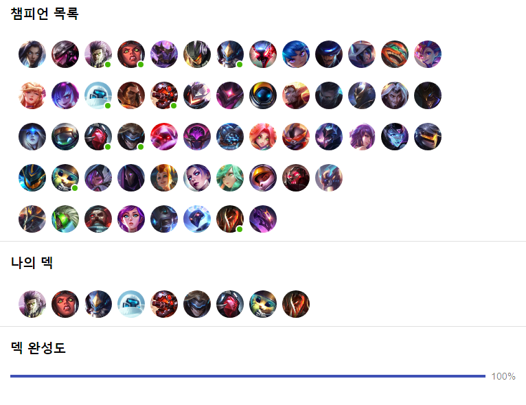

## 롤토체스 헬퍼

롤토체스 게임을 하면서 전략을 도와주는 앱 React로 만들기

### 데모

https://zerostrength.github.io/lolchess/

### 기능

- 챔피언 클릭으로 선택/해제 가능
- 선택된 챔피언 목록에서 레벨 ▲ ▼ 가능

#### 개발정보

- 라이엇에서 static 정보 받아오기 https://developer.riotgames.com/docs/tft
- API로 상위 티어 매치 정보 가지고 오기

#### 현재 선택한 챔피언과 비교
